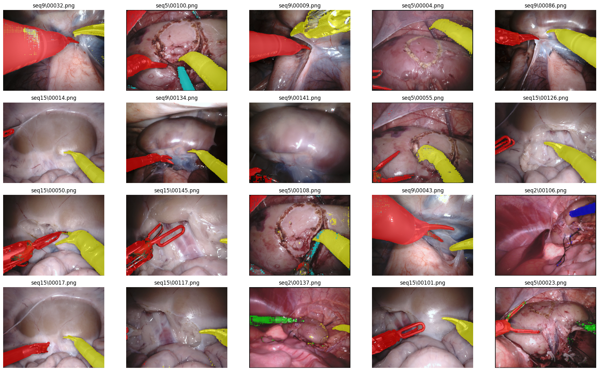

## Disclaimer
This GIT Repo is a copy with modifications from the original paper https://arxiv.org/pdf/2308.08746v2 sugrical SAM.
In this repo are tests for adding more generalizability with CLIP text embeddings under the branch clipDev. 
There are also jupyter notebooks for visualization needs. Thanks to the original author **Wenxi Yue, Jing Zhang, Kun Hu, Yong Xia, Jiebo Luo, Zhiyong Wang** for making their work publicly available.
Parts have been copied for easier navigation for people with SurgicalSAM expertise. 


## Abstract 
The Segment Anything Model (SAM) has transformed image segmentation but struggles with surgical instrument segmentation (SIS) due to domain gaps between natural and medical images. Traditionally, SAM operates in a zero-shot manner, requiring precise manual prompts for accurate segmentation, which is impractical in the complex medical field. To address these challenges, we build upon the SurgicalSAM model, which integrates surgical-specific information to reduce the need for manual inputs and serves as a foundation for generalization. In this work, we explore various approaches, including the use of MedSAM, to further enhance the adaptability of SurgicalSAM. We introduce SurgicalSAM-CLIP, which incorporates CLIP text prompts to improve the model's generalization to unseen datasets. Extensive experiments on EndoVis2017 and EndoVis2018 datasets demonstrate that SurgicalSAM-CLIP effectively bridges the domain gap, achieving better generalization compared to the baseline SurgicalSAM, and advancing the capabilities of SIS without extensive manual intervention.


<figcaption align = "center"><b>Figure 1: Overview of SurgicalSAM. 
 </b></figcaption>
 
## Results

<p align="center">
  
</p>

<figcaption align = "center"><b>Figure 2: Visualisation Results of SurgicalSAM-CLIP.
 </b></figcaption>

## Installation

Following [Segment Anything](https://github.com/facebookresearch/segment-anything), the code requires `python>=3.8`, as well as `pytorch>=1.7` and `torchvision>=0.8`. For SurgicalSAM, `python=3.8`, `pytorch=1.11.0`, and `torchvision=0.12.0` are used.

1. Clone the repository.
      ```
      git clone https://github.com/wenxi-yue/SurgicalSAM.git
      cd SurgicalSAM
      ```

2. Create a virtual environment for SurgicalSAM and and activate the environment.
    ```
    conda create -n surgicalsam python=3.8 -y
    conda activate surgicalsam
    ```
3. Install Pytorch and TorchVision. In our case, we use `pip install torch==1.11.0+cu113 torchvision==0.12.0+cu113 --extra-index-url https://download.pytorch.org/whl/cu113`. Please follow the instructions [here](https://pytorch.org/get-started/locally/) for installation in your specific condition. 

4. Install other dependencies.
    ```
    pip install -r requirements.txt
    ```

## Data
We use the [EndoVis2018](https://endovissub2018-roboticscenesegmentation.grand-challenge.org/) [1] and [EndoVis2017](https://endovissub2017-roboticinstrumentsegmentation.grand-challenge.org/) [2] datasets in our experiments. 

For EndoVis2018, we use the instrument type segmentation annotation provided [here](https://github.com/BCV-Uniandes/ISINet) by [3].
For EndoVis2017, we follow the pre-processing strategies and cross-validation splits provided [here](https://github.com/ternaus/robot-surgery-segmentation).

In SurgicalSAM, we use the pre-computed SAM features since the image encoder is frozen. We provide the pre-computed SAM features and ground-truth annotations [here](https://unisyd-my.sharepoint.com/:f:/g/personal/wenxi_yue_sydney_edu_au/Et9Nz5d4r2BDkDTakggPMFAB11UNIfbUN3PNz71p1XP0Ug). You may use our provided pre-computed SAM features or [generate SAM features from scratch](https://github.com/facebookresearch/segment-anything). 

For inference, please follow the inference instructions below. No further data processing is needed. 

For training, we augment the training data and pre-compute their SAM features before training (offline). Alternatively, you can opt for data augmentation during training (online), which provides greater augmentation diversity. Our training data augmentation is performed as below.
```
cd surgicalSAM/tools/
python data_preprocess.py  --dataset endovis_2018  --n-version 40
python data_preprocess.py  --dataset endovis_2017  --n-version 40
```

The **class ID** and **surgical instrument category** correspondence for the two datasets is shown below. 

Dataset | 1 | 2 | 3 | 4 | 5 | 6 | 7 |
:---: | :---: | :---: | :---: |:---: |:---: |:---: |:---: |
**EndoVis2018** | Bipolar Forceps | Prograsp Forceps | Large Needle Driver | Monopolar Curved Scissors | Ultrasound Probe | Suction Instrument | Clip Applier |
**EndoVis2017** | Bipolar Forceps | Prograsp Forceps | Large Needle Driver | Vessel Sealer | Grasping Retractor | Monopolar Curved Scissors | Others |

## Checkpoints

In SurgicalSAM, `vit_h` is used. 

Please find the checkpoint of SAM in `vit_h` version [here](https://dl.fbaipublicfiles.com/segment_anything/sam_vit_h_4b8939.pth). 

Surigcal-SAM provides the checkpoint of our trained SurgicalSAM [in the ckp.zip here](https://unisyd-my.sharepoint.com/:f:/g/personal/wenxi_yue_sydney_edu_au/Et9Nz5d4r2BDkDTakggPMFAB11UNIfbUN3PNz71p1XP0Ug).
Surgical-SAM-CLIP checkpoints can be found [here](https://drive.google.com/drive/folders/1dDTxvZGY2-Y3reFC1syQUvt-XBy-fu_Q?usp=sharing). 

For MedSAM, there are available models here: https://drive.google.com/drive/folders/1ETWmi4AiniJeWOt6HAsYgTjYv_fkgzoN?usp=drive_link

##  File Organisation
After downloading the data and model checkpoints and preprocessing the data, the files should be organised as follows.

  ```tree
  SurgicalSAM
      |__assets
      |    ...
      |__data
      |    |__endovis_2018
      |    |       |__train
      |    |       |  |__0
      |    |       |  |  |__binary_annotations
      |    |       |  |  |     ...
      |    |       |  |  |__class_embeddings_h
      |    |       |  |  |     ...
      |    |       |  |  |__images
      |    |       |  |  |     ...
      |    |       |  |  |__sam_features_h
      |    |       |  |       ...
      |    |       |  |__1
      |    |       |  |  ...
      |    |       |  |__2
      |    |       |  |  ...
      |    |       |  |__3
      |    |       |  |  ...
      |    |       |  |__...
      |    |       |     
      |    |       |__val
      |    |            |__annotations
      |    |            |     ...
      |    |            |__binary_annotations
      |    |            |     ...
      |    |            |__class_embeddings_h
      |    |            |     ...
      |    |            |__sam_features_h
      |    |                  ...
      |    |                   
      |    |__endovis_2017
      |              |__0
      |              |  |__annotations
      |              |  |     ...
      |              |  |__binary_annotations
      |              |  |     ...
      |              |  |__class_embeddings_h
      |              |  |     ...
      |              |  |__images
      |              |  |     ...
      |              |  |__sam_features_h
      |              |       ...
      |              |__1
      |              |  ...
      |              |__2
      |              |  ...
      |              |__3
      |              |  ...
      |              |__...
      |                   
      |__ckp
      |    |__sam
      |    |   |__sam_vit_h_4b8939.pth
      |    |
      |    |__surgical_sam
      |            |__endovis_2018
      |            |     ...
      |            |__endovis_2017
      |                    |__fold0
      |                    |     ...
      |                    |__fold1
      |                    |     ...
      |                    |__fold2
      |                    |     ...
      |                    |__fold3
      |                          ...
      |   
      |__segment_anything
      |    ...
      |__surgicalSAM
           ...
  ```

##  Train
To train the model:
```
cd surgicalSAM/
python train_clip_full.py  --dataset endovis_2018 --isWindows True --log True
python train_clip_full.py  --dataset endovis_2017  --fold 0 --isWindows True --log True
```

## Add CLIP prompts
For training with different CLIP text prompts you can set them directly in the train_clip_full.py. Currently, they are named like:
```
instrument_details = [
    "bipolar forceps have a slim, elongated tweezer-like design with opposing tips, are silver-colored, made from high-quality metal, and feature an insulated shaft for controlled energy application.",
    "prograsp forceps possess curved scissor-like handles, specialized grasping tips with interlocking jaws, a ratcheting mechanism, and color-coded markings for easy identification during surgery.",
    "large needle drivers feature elongated handles, sturdy gripping surfaces, a curved or straight jaw tip for securely holding needles, and a locking mechanism to ensure precision and control.",
    "monopolar curved scissors showcase elongated handles, curved cutting edges for precise dissection, and an insulated shaft, allowing controlled application of electrical energy for cutting and coagulation.",
    "ultrasound probes feature a long, slender handle, a small transducer head for producing ultrasound waves, and a flexible cable connecting the probe to the ultrasound machine for real-time imaging guidance.",
    "suction instruments appear as elongated tubes with a narrow, hollow tip for fluid and debris removal, connected to a handle and tubing system for vacuum generation and precise control during the procedure.",
    "clip appliers feature elongated handles, a shaft with a specialized tip for holding and releasing clips, and a mechanism to advance and deploy the clips precisely for secure tissue or vessel closure.",
]
```


##  Inference
To run inference on our provided SurgicalSAM checkpoints and obtain evaluation results you can use the original:
```
cd surgicalSAM/
python inference.py  --dataset endovis_2018
python inference.py  --dataset endovis_2017  --fold 0
```

Or for good visualisation of your results using the created Jupyter notebooks:
```
cd surgicalSAM/Jupyer Notebook Inference etc/
juptyer-notebook inference_SSAM_clip.ipynb
```
The GPU memory usage for inference when using pre-computed feature is 2.16 GB. 

##  Citing SurgicalSAM

If you find SurgicalSAM helpful, please consider citing the original authors from surgical SAM:
```
@article{yue_surgicalsam,
  title={SurgicalSAM: Efficient Class Promptable Surgical Instrument Segmentation},
  author={Yue, Wenxi and Zhang, Jing and Hu, Kun and Xia, Yong and Luo, Jiebo and Wang, Zhiyong},
  booktitle={AAAI},
  year={2024}
}
```


##  Acknowledgement
This project is built upon [Segment Anything](https://github.com/facebookresearch/segment-anything). We thank the authors for their great work.

Thanks to original authors of the git repo https://github.com/wenxi-yue/SurgicalSAM?tab=readme-ov-file .

Thanks as well to the team of MedSAM for their work : https://github.com/bowang-lab/MedSAM
